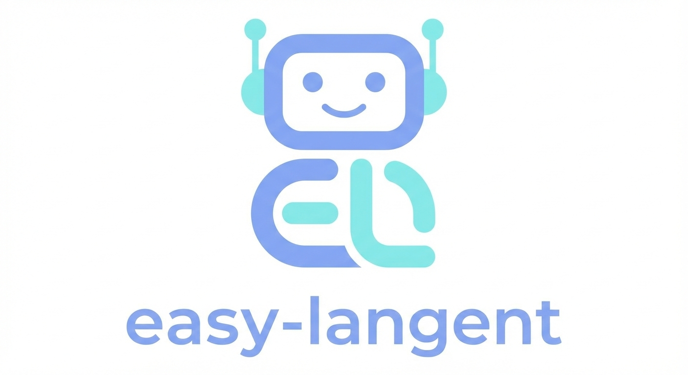

    
    <h1>Easy-langent（⚠️ Alpha内测版）</h1>

> [!CAUTION]
> ⚠️ Alpha内测版本警告：此为早期内部构建版本，尚不完整且可能存在错误，欢迎大家提Issue反馈问题或建议。

   

📚 在线阅读地址 (正在筹备，尽情期待...)

📚 简单的lang框架智能体开发实践教程

## 项目介绍

当大模型技术从“单点能力突破”迈向“场景化应用落地”，智能体（Agent）已成为连接技术与实际需求的核心载体。然而，多数初学者在接触智能体开发时，常陷入“框架概念繁杂、实操无从下手、技术与应用脱节”的困境——要么被复杂的理论体系吓退，要么掌握了框架基础却不知如何落地真实项目。

“langent”由“lang”（代表LangChain、LangGraph等语言大模型开发框架）与“agent”（智能体）合并而来，核心目标是打破“理论学习”与“实战开发”的壁垒：让读者在系统掌握智能体核心逻辑的同时，真正学会运用LangChain、LangGraph框架解决实际开发问题，实现“从懂概念到会开发”的跨越。

本项目配套的学习大纲遵循“循序渐进、实践导向”的设计原则，从框架基础认知入手，逐步深入核心组件实操、进阶应用开发，再到多智能体协作与系统优化，最终通过综合实战完成知识闭环。我们摒弃冗余的理论堆砌，聚焦“用框架做开发”的核心需求，每一章都配套针对性的实操任务，确保读者在学习过程中能够动手实践、深化理解。

## 项目受众

无论你是希望入门智能体开发的高校学生，还是寻求技术落地的开发者，都能通过本项目找到清晰的学习路径。

**前置知识要求：**

- 熟悉Python编程语言基础
- 对大模型技术有基本了解
- 对智能体的核心概念有基本了解

## 📖 内容导航

| 章节                                              | 关键内容                     | 状态 |
| ------------------------------------------------- | ---------------------------- | ---- |
| <strong>第一部分：前言</strong> |  |  |
| [前言](./docs/前言.md)        | 前言与读者建议   | ✅    |
| [第一章 LangChain与LangGraph框架认知](./docs/chapter1.md) |  框架介绍、环境安装、lang框架体验| ✅    |
| <strong>第二部分：LangChain组件与实战</strong> |  |  |
| [第二章 LangChain核心组件实操](./docs/chapter2.md) | 模型调用、提示词模板、输出解析 | ✅    |
| [第三章 LangChain进阶组件实操](./docs/chapter3.md) | 记忆、工具、组合实践 | ✅    |
| [第四章 LangChain应用级系统设计与RAG实践](./docs/chapter4.md) | 链式工作流、RAG实践 | ✅    |
| [第五章 课程中期综合实践：智能体应用设计与实现](./docs/chapter5.md) | 中期综合实践 | ✅    |
| <strong>第三部分：LangGraph组件与实战</strong> |  |  |
| [第六章 LangGraph基础：有状态工作流与核心概念实操](./docs/chapter6.md) | 有状态工作流、节点、边、状态管理 | ✅    |
| 第七章 LangGraph进阶：多智能体协作与复杂流程管控  | 智能体定义、类型、范式与应用 | 🚧    |
| 第八章 SKILL在lang系列框架中的应用     | 智能体定义、类型、范式与应用 | 🚧    |
| 第九章 综合实战：从零构建可落地的智能体系统       | 智能体定义、类型、范式与应用 | 🚧    |

## 核心贡献者
- [牧小熊-项目负责人](https://github.com/muxiaoxiong) (Datawhale成员-武汉负责人)

## 特别感谢

- 感谢 [@Sm1les](https://github.com/Sm1les) 对本项目的帮助与支持
- 感谢所有为本项目做出贡献的开发者们 ❤️

## 参与贡献

- 如果你发现了一些问题，可以提Issue进行反馈，如果提完没有人回复你可以联系[保姆团队](https://github.com/datawhalechina/DOPMC/blob/main/OP.md)的同学进行反馈跟进~
- 如果你想参与贡献本项目，可以提Pull request，如果提完没有人回复你可以联系[保姆团队](https://github.com/datawhalechina/DOPMC/blob/main/OP.md)的同学进行反馈跟进~
- 如果你对 Datawhale 很感兴趣并想要发起一个新的项目，请按照[Datawhale开源项目指南](https://github.com/datawhalechina/DOPMC/blob/main/GUIDE.md)进行操作即可~

## 关注我们

扫描下方二维码关注公众号：Datawhale

## LICENSE

 本作品采用<a rel="license" href="http://creativecommons.org/licenses/by-nc-sa/4.0/">知识共享署名-非商业性使用-相同方式共享 4.0 国际许可协议</a>进行许可。
